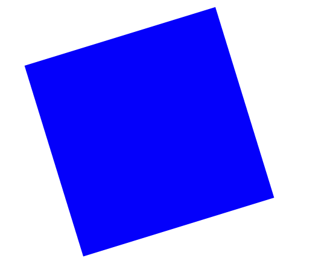

# TP - Animations

Reproduisez cette animation :

Les contraintes :
* Passer du rouge au bleu
* Au survol de la souris, le carré se transforme en rectangle
* A la sortie de la souris, la forme redevient carré
* La forme est en rotation sur elle-même.