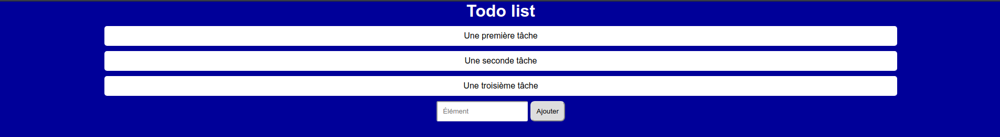

# Exercices 01 - Les sélecteurs

* Créer un fichier HTML _todolist.html_ avec le contenu suivant :

```html
<!doctype html>
<html lang="fr">
<head>
    <meta charset="UTF-8">
    <meta name="viewport" content="width=device-width, user-scalable=no, initial-scale=1.0, maximum-scale=1.0, minimum-scale=1.0">
    <meta http-equiv="X-UA-Compatible" content="ie=edge">
    <link rel="stylesheet" href="todo.css">
    <title>Todo list</title>
</head>
<body>
    <h1>Todo list</h1>
    <ul>
        <li class="item">Une première tâche</li>
        <li class="item">Une seconde tâche</li>
        <li class="item">Une troisième tâche</li>
    </ul>
    <form>
        <input type="text" placeholder="Élément" />
        <input type="submit" value="Ajouter" />
    </form>
</body>
</html>
```

* Créer un fichier _todo.css_.

* Compléter le fichier _todo.css_ pour avoir le rendu suivant :




> Indications
> * Couleur de fond:  #000099
> * Police : 'Helvetica', 'Arial'
> * Texte des listes centré
> * Espacement de 10px autour du texte
> * Arrondis :
>   * 3px pour le champ de saisie
>   * 5px pour la liste
>   * 8px pour le bouton