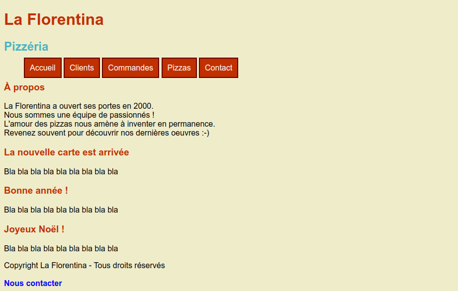

# Exercices 01 - Propriétés

* Créer un fichier `pizzeria.html` avec le contenu suivant :

```html
<!doctype html>
<html lang="fr">
<head>
    <meta charset="UTF-8">
    <link rel="stylesheet" href="pizzeria.css">
    <title>Pizzeria</title>
</head>
<body>
<header>
    <h1>La Florentina</h1>
    <h2>Pizzéria</h2>
</header>
<nav>
    <ul>
        <li><a href="#">Accueil</a></li>
        <li><a href="#">Clients</a></li>
        <li><a href="#">Commandes</a></li>
        <li><a href="#">Pizzas</a></li>
        <li><a href="#">Contact</a></li>
    </ul>
</nav>
<section>
    <aside>
        <h1>À propos</h1>
        <p>
            La Florentina a ouvert ses portes en 2000.<br/>
            Nous sommes une équipe de passionnés !<br/>
            L'amour des pizzas nous amène à inventer en permanence.<br/>
            Revenez souvent pour découvrir nos dernières oeuvres :-)<br/>
        </p>
    </aside>
    <article>
        <h1>La nouvelle carte est arrivée</h1>
        <p>Bla bla bla bla bla bla bla bla bla</p>
    </article>
    <article>
        <h1>Bonne année !</h1>
        <p>Bla bla bla bla bla bla bla bla bla</p>
    </article>
    <article>
        <h1>Joyeux Noël !</h1>
        <p>Bla bla bla bla bla bla bla bla bla</p>
    </article>
</section>
<footer>
    <p>Copyright La Florentina - Tous droits réservés<br/><br/>
        <a href="#">Nous contacter</a></p>
</footer>
</body>
</html>
```

* Créer un fichier `pizzeria.css`. Compléter ce fichier pour avoir le rendu suivant :



> Indications::
> * Couleur de fond: #EFECCA
> * Police : 'Helvetica', 'Arial'
> * Titre h1 : #C03000;
> * Titre h2 : #4BB5C1;
> * Menu
>   * Bord : #660000
>   * Fond : #C03000
>   * Fond au survol : #009900. Conserver ce fond également lorsque le menu est sélectionné.
>   * Pied de page
>   * Lien "Nous contacter" : #0000FF, non souligné.